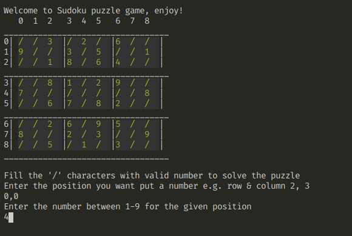

# Sudoku

## Starting the Sudoku game
- `ruby Game.rb`

__Note: To change the puzzle in the Game.rb change line 41 with the files from the puzzle folder__

## Dependecy
- [colorize gem !](https://github.com/fazibear/colorize)
